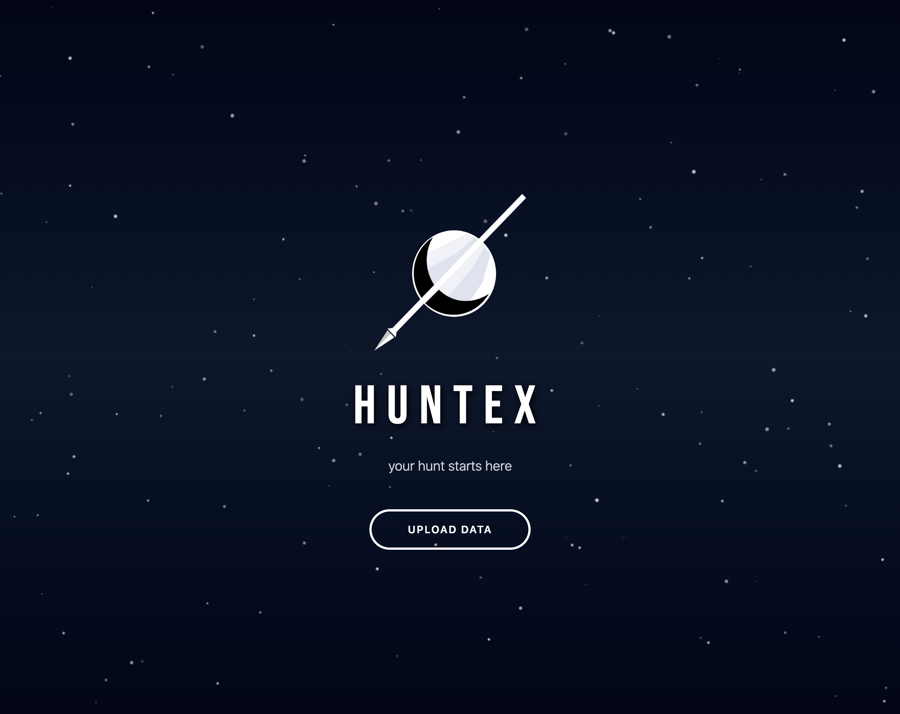
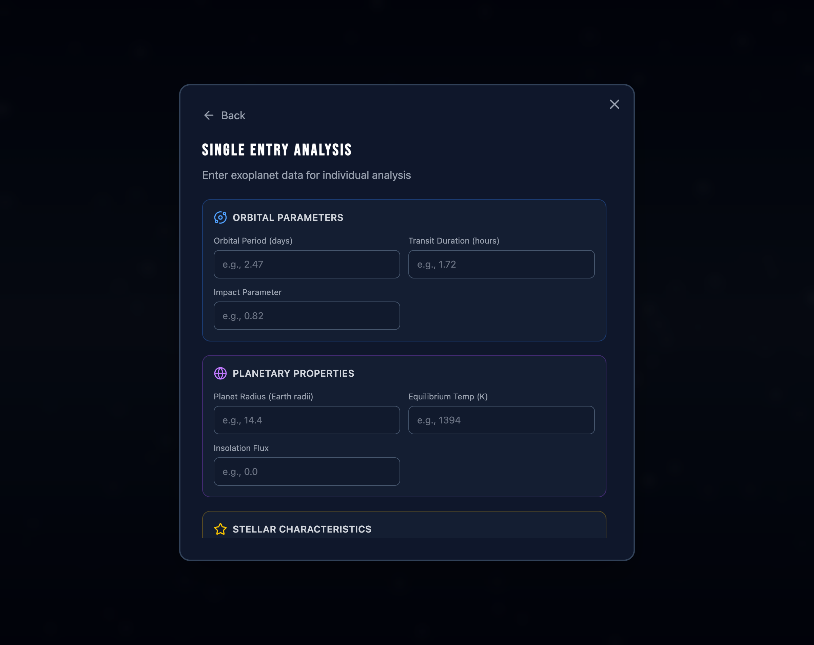
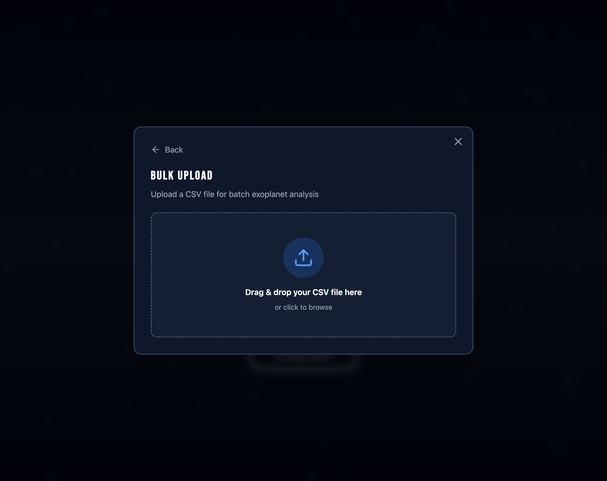
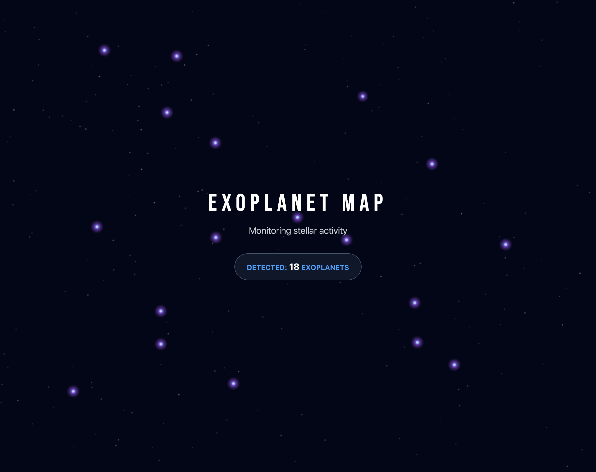

# 🌌 HuntEX - Exoplanet Detection System

> Built for NASA Space Apps Challenge Hackathon 🚀

An interactive web application that visualizes exoplanet detection using machine learning predictions. Upload your data and watch the universe reveal its secrets through a stunning space-themed interface.



## 🎯 What is HuntEX?

HuntEX is a web-based exoplanet detection visualization tool that combines machine learning predictions with an engaging UI/UX experience. The app simulates the detection of exoplanets in real-time, presenting them on an interactive star map where users can explore detailed planetary data.

## 🤖 The Core: Our ML Model

**The heart of this project is our custom-trained Random Forest classifier** that analyzes real Kepler telescope data to identify exoplanets. This was the primary goal of our NASA Space Apps Challenge submission.

### 🏆 Model Highlights
- **~85% accuracy** on exoplanet classification
- **12 orbital & stellar features** used for prediction
- **3-class classification**: CONFIRMED, CANDIDATE, FALSE POSITIVE
- **Random Forest ensemble** with 200 decision trees
- **Balanced training** with SMOTE for handling class imbalance
- **Real Kepler data** from NASA's KOI catalog (~9,500 entries)

### 📂 Model Repository

The complete ML pipeline lives in the **[`Improved-RF/`](./Improved-RF)** directory:

```
📊 Kepler Data (9,500 KOIs)
    ↓
🔧 Preprocessing (data.py)
    ↓
🤖 Random Forest Training (main.py)
    ↓
📈 Evaluation & Metrics (evaluate.py)
    ↓
💾 model.joblib (Production Model)
    ↓
🌐 Web App Integration
```

**What's inside:**
- Full training & evaluation code
- Data preprocessing pipeline
- Hyperparameter tuning experiments
- Feature importance analysis
- Confusion matrix & performance metrics
- **Comprehensive documentation** in [`Improved-RF/README.md`](./Improved-RF/README.md)

**👉 [View the ML Model Documentation](./Improved-RF/README.md)** for technical details, training instructions, and model architecture.

This web application serves as the **visualization layer** for our ML model, making exoplanet detection accessible and engaging for everyone.

## ✨ Features

### 🎨 Beautiful UI/UX
- **Space-themed design** with particle animations and star fields
- **Glassmorphism effects** and smooth Framer Motion animations
- **Hyperspace transition** animation between sections (4-second warp speed effect)
- **Interactive star map** with pulsating exoplanet markers

### 📊 Dual Input Modes

#### Single Entry Analysis
Manual input form with 11 exoplanet parameters organized in 4 categories:
- 🌀 **Orbital Parameters** - Period, Duration, Impact
- 🌍 **Planetary Properties** - Radius, Temperature, Insolation
- ⭐ **Stellar Characteristics** - Effective Temp, Gravity, Radius
- 📡 **Signal Metrics** - Transit Depth, Signal-to-Noise Ratio



#### Bulk Upload
CSV file upload for batch analysis:
- Drag & drop interface
- 100MB file size limit
- Real-time validation and error reporting



### 🌟 Interactive Results Page
- **Animated star field** with 300+ background stars
- **Real-time exoplanet detection** (limited to 5 for demo)
- **Multi-ring visualization** for detected exoplanets with:
  - Outer halo (6x base size)
  - Mid gradient glow (3.5x)
  - Bright white core (1.5x)
- **Smart positioning** - exoplanets only appear in safe zones (10% margin from edges)
- **Clickable exoplanets** with detailed side panel information



## 🛠️ Tech Stack

### Frontend
- **React 19** + **TypeScript** - Modern UI framework
- **Vite 7** - Lightning-fast build tool
- **Tailwind CSS v4** - Utility-first styling
- **Framer Motion** - Smooth animations
- **Lucide React** - Beautiful icons
- **HTML5 Canvas** - Custom star field & animations

### Backend
- **Express.js** - API server with CORS support
- **Python 3** - ML model inference via subprocess
- **Multer** - CSV file upload handling
- **Joblib** - ML model serialization

## 🚀 Getting Started

### Prerequisites
- Node.js 18+
- npm or yarn

### Installation

```bash
# Clone the repository
git clone https://github.com/jnjambrin0/huntex-app
cd huntex-app

# Install dependencies
npm install

# Start development server
npm run dev
```

The app will be available at `http://localhost:5173`

### Environment Variables

Create a `.env` file in `huntex-app/`:

```env
VITE_API_BASE_URL=http://localhost:8000
```

If not set, defaults to `http://localhost:8000`.

## 📁 Project Structure

```
huntex-app/
├── src/                              # Frontend React application
│   ├── components/
│   │   ├── AnimatedBackground.tsx    # Particle background
│   │   ├── HyperspaceAnimation.tsx   # Warp speed effect
│   │   ├── UploadModal.tsx           # Modal container
│   │   ├── SingleEntryForm.tsx       # Manual data entry
│   │   ├── BulkUploadForm.tsx        # CSV upload
│   │   └── ResultsPage.tsx           # Star map & detections
│   ├── types/
│   │   └── exoplanet.ts              # TypeScript interfaces
│   ├── App.tsx                       # Main app logic
│   ├── main.tsx                      # React entry point
│   └── index.css                     # Tailwind imports
├── server/                           # Backend API
│   ├── index.js                      # Express API server
│   ├── predict.py                    # ML prediction script
│   ├── preprocess.py                 # CSV preprocessing pipeline
│   └── training_stats.json           # Training set statistics
├── Improved-RF/                      # 🤖 ML MODEL (Core of the project)
│   ├── main.py                       # Training entry point
│   ├── model.py                      # Random Forest wrapper
│   ├── data.py                       # Data preprocessing
│   ├── train.py                      # Training pipeline
│   ├── evaluate.py                   # Metrics & visualization
│   ├── config.py                     # Configuration system
│   ├── results/                      # Model outputs & plots
│   ├── examples/                     # Sample datasets
│   ├── tools/                        # Utilities
│   ├── GAN/                          # Experimental data augmentation
│   └── README.md                     # 📖 Full ML documentation
├── public/
│   └── logo.png                      # HuntEX logo
├── docs/                             # Screenshots & documentation
├── model.joblib                      # Trained ML model (production)
├── CLAUDE.md                         # Developer instructions
└── package.json
```

## 🎮 How to Use

1. **Launch the app** - You'll see the HuntEX landing page with animated background
2. **Click "UPLOAD DATA"** - Modal opens with two options
3. **Choose your method**:
   - **Single Entry**: Fill in the 11 exoplanet parameters manually
   - **Bulk Upload**: Drop a CSV file with multiple entries
4. **Submit your data** - Hyperspace animation plays (4 seconds)
5. **Explore results** - Interactive star map loads with:
   - Background stars
   - Detected exoplanets (pulsating blue/purple markers)
   - Real-time counter showing detections
6. **Click on exoplanets** - View detailed planetary data in side panel

## 🎨 Design Highlights

### Color Palette
- **Background**: Slate-950 to Slate-900 gradient
- **Accents**: Blue-400, Purple-500, Violet-500
- **Text**: White with gray-300/400 for secondary content

### Typography
- **Primary Font**: Bebas Neue (Google Fonts)
- **Wide letter-spacing** (0.2em) for sci-fi aesthetic
- **Uppercase headings** for impact

### Animations
- **Framer Motion** for UI transitions
- **Canvas-based** particle systems and star fields
- **Spring physics** for modal animations
- **Easing functions** for smooth movements

## 🔬 Technical Details

### Exoplanet Detection Logic
- Detects 1 exoplanet every 4 seconds
- Maximum 5 exoplanets for demo mode
- Safe zone positioning (10% margin from screen edges)
- Consistent sizing (2.5px base) regardless of original star size
- Multi-ring gradient visualization for high visibility

### Canvas Rendering
- 300 background stars with subtle pulsing
- Responsive canvas resizing
- Optimized animation loop with `requestAnimationFrame`
- Smooth transitions with easing (0.1 smoothing factor)

### API Integration
- **POST** `/api/single-predict` - Single entry predictions
- **POST** `/api/bulk-upload` - CSV batch processing
- Optimistic UI pattern (immediate transitions, background API calls)

## 🖥️ Server Architecture

The backend lives in `server/` and consists of two components:

### Express API Server (`server/index.js`)
- **Port**: 8000 (configurable via `PORT` env var)
- **CORS**: Enabled for all origins (`*`)
- **File uploads**: Handled by Multer with 100MB limit
- **Logging**: Structured JSON logs to stdout
- **Error handling**: Graceful error responses with cleanup

**Endpoints:**
- `POST /api/single-predict` - Accepts JSON with 11 exoplanet parameters
- `POST /api/bulk-upload` - Accepts CSV file via multipart form data

### Python Prediction Script (`server/predict.py`)
- **Model**: Loads `model.joblib` (scikit-learn model bundle)
- **Modes**:
  - `single` - Predicts one data point from JSON
  - `bulk` - Predicts all rows from CSV file
- **Output**: JSON with predictions (`CONFIRMED`, `CANDIDATE`, `FALSE POSITIVE`)
- **Validation**: Checks for missing features and invalid data types

**Running the server:**
```bash
npm run server  # Starts Express on port 8000
```

## 🔄 Complete ML Pipeline: From Training to Visualization

Our project showcases the full data science workflow:

### 1️⃣ Model Training (`Improved-RF/`)
```bash
cd Improved-RF
python main.py
```
- Loads raw Kepler KOI catalog data
- Preprocesses features (normalization, log transforms, imputation)
- Trains Random Forest classifier with cross-validation
- Evaluates performance (accuracy, F1, confusion matrix)
- Saves trained model to `model.joblib`

### 2️⃣ Backend Integration (`server/`)
- Express server loads the trained model
- Accepts user data via REST API
- Preprocesses input (same pipeline as training)
- Runs inference using `predict.py`
- Returns classification: CONFIRMED, CANDIDATE, or FALSE POSITIVE

### 3️⃣ Frontend Visualization (`src/`)
- React app sends exoplanet data to backend
- Receives ML predictions in real-time
- Filters to show only CONFIRMED and CANDIDATE detections
- Animates results on interactive star map
- Displays detailed planetary parameters with scientific units

### 🎯 The Result
A complete end-to-end system from raw astronomical data → machine learning → interactive visualization, making exoplanet science accessible to everyone.

## 👥 Team

Built with ❤️ for the NASA Space Apps Challenge by our amazing hackathon team.

## 📝 License

This is a hackathon project built for educational purposes.

## 🙏 Acknowledgments

- **NASA** for the Space Apps Challenge
- **Kepler Space Telescope** data for exoplanet research
- **React** and **Vite** communities for excellent tools

---